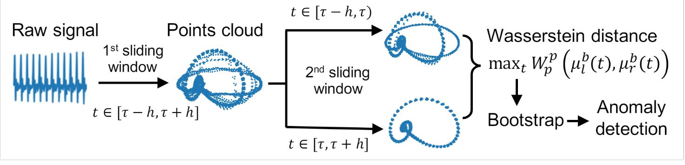
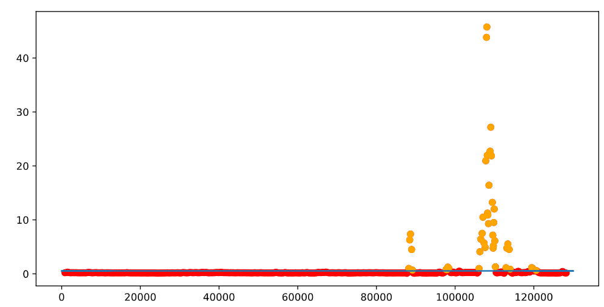
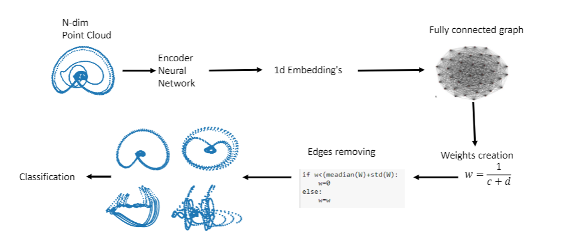
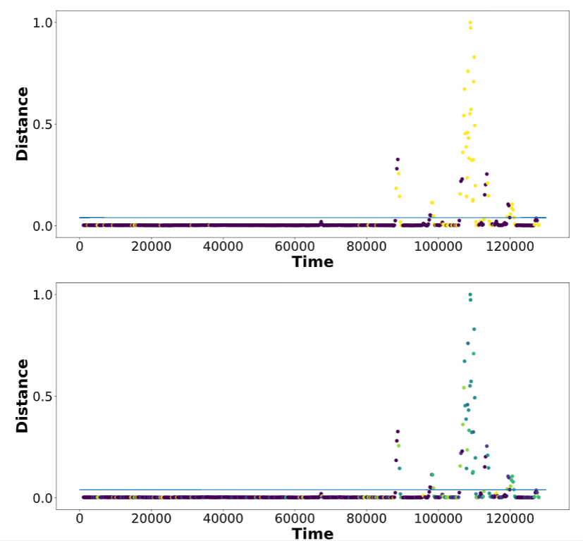
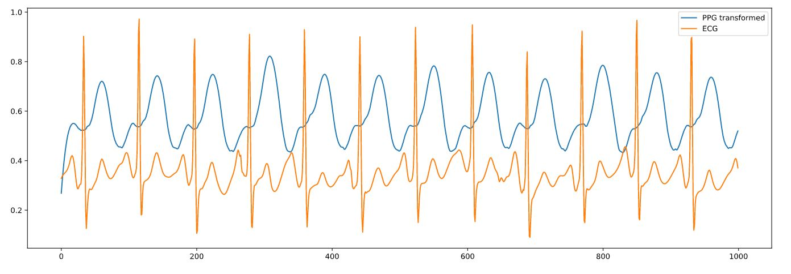

# Unsupervised-heart-beat-anomalies-detection

This Repositiry consist from 2 main part, Heart beat anomalies detection(Arrhythmia) and blood pressure estimation

# 1) Heart Beat Anomalies Detection
## Bootstrap Algorithm (Binary classification scenario)
We propose    a    new    unsupervised    and    non-parametric  method  to  detect  change  points  in electrocardiography.  The detection relies on  optimal  transport  theory  combined  with  topological analysis and the bootstrap procedure.  The algorithm is designed to detect changes in virtually any harmonic or a partially harmonic signal and is verified on ECG data streams.  We successfully find abnormal or irregular cardiac cycles in the waveforms for the six of the most frequent types of clinical arrhythmias using a single algorithm. Our unsupervised approach reaches the level of performance of the supervised state-of-the-art techniques.  We provide conceptual justification for  the efficiency of the method.

## Requirements:
biosppy

heartpy

POT(conda install -c conda-forge pot)

## Usage
Example of usage describes in Example Bootstrap Algorithm.ipynb. As a result we have points which corresponds to Wasserstein distances inside each point cloud. Each point has corresponded indexes, then it is possible to find are with arrhythmia in original time series.

## Multi labels classification

Algorithm based on multi labels multi dimensional classification. Algorithm has the following pipeline:

Encoder located in folder model, weights for ECG located in model/weights_original and model/weights_clusters. Clustering algothm based on Infomap algorithm.

## Requirements
Pytorch

Infomap

POT

## Training
Training Encoders, clustering you can find in the following files:clustering.ipynb,Encoder training.ipynb,Encoder cluster separation.ipynb.

Encoder in input takes n-dim point clouds and return stack of corresponded latent vectors.
If you want reproduce results please download the following stack of point clouds corresponded to some ECG data from mitbih dataset. The same data you need to use for clustering algorithm for result reproducing.
Plese notice, that if you want reproduce results, please download the following data https://www.dropbox.com/sh/pqy946oqpkdfr2c/AADA0weiR87hMymiMMuYd8HRa?dl=0 .

curves_2_wind_100.pkl is point clouds and you need locate it to data folder, i.e. data/curves_2_wind_100.pkl
distances_total_new_norm_.pkl is distances between latent vectors corresponds to point clouds. you need locate it to clustering_data, i.e. clustering_data/distances_total_new_norm_.pkl

## Usage
Example of multi labels classification algorithm in Multiclass algorithm is shown.

# 1) Blood Pressure Estimation

Project located in folder Blood Pressure, the main idea to present PPG signal via ECG. As a result we can find Pulse Arrival Time. It is useful when PPG signal is noisy or absent. The base model is LSTM with possibility of teacher forcing. We use it as transformer for ECG to PPG, but it is work on any time series data.
If you want to represent results, please download the following data https://www.kaggle.com/mkachuee/BloodPressureDataset

## Requirements
Pytorch

biosppy

heartpy

scipy

## training
Training process in LSTM_train.ipynb is presented.

## Usage, results

In Model folder you can find the main modeules for neural network, in weights folder you can find weights.

